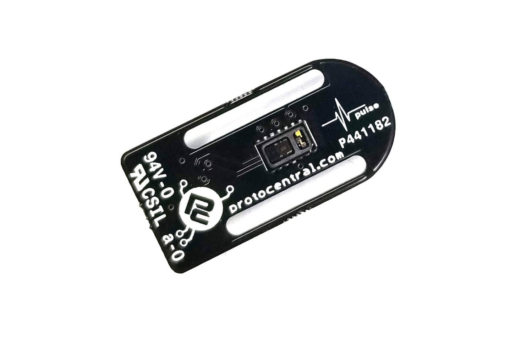

# ProtoCentral Pulse — Hardware

Open-source hardware design files for the **ProtoCentral Pulse** pulse-oximetry / heart-rate breakout — built around the [Maxim MAX30102](https://www.analog.com/en/products/max30102.html) integrated pulse-oximeter and heart-rate sensor, which combines the red and IR LEDs, photodiode, and analog front end in a single OLGA-14 package.

The board streams raw PPG (photoplethysmogram) samples over I²C; SpO₂ and heart-rate calculation runs on your host MCU using our open-source Arduino library. That keeps the full optical signal visible, which is what makes the board useful for research, algorithm development, and teaching.

## Links

| | |
|---|---|
| 🛒 Product page | https://protocentral.com/product/pulse-3-pulse-ox-heart-rate-sensor-based-on-max30102-qwiic-compatible/ |
| 💻 Arduino library | https://github.com/Protocentral/protocentral_max30102_arduino |
| 📄 IC datasheet (Analog Devices / Maxim) | https://www.analog.com/media/en/technical-documentation/data-sheets/MAX30102.pdf |

## Specifications

- **Sensor:** Maxim MAX30102 — integrated red (660 nm) + IR (880 nm) LEDs, photodiode, and AFE
- **Output:** raw 18-bit PPG samples per channel, read over the sensor FIFO
- **Interface:** I²C, fixed address `0x57`
- **Connector:** Qwiic (1 mm 4-pin, right-angle)
- **Supply:** onboard AP2112K-1.8 V LDO with level translation to the host
- **Board:** 29.7 × 16.4 mm, 6-layer

## Revisions

| Revision | Design files | Notes |
|---|---|---|
| **v4** (current) | [`hardware/`](hardware/) | KiCad 10; 6-layer; Qwiic |
| v3 and earlier | [`Pulse_MAX30102/Hardware/`](https://github.com/Protocentral/Pulse_MAX30102/tree/master/Hardware) | Eagle; retained in the original repository so existing links keep working |

## Repository layout

| Folder | Contents |
|---|---|
| [`hardware/`](hardware/) | KiCad project (schematic + PCB layout) and the exported [schematic PDF](hardware/protocentral-pulse-v4-schematic.pdf) |

## Important notice

This device is intended for research, education, and evaluation use only. It is **not** a medical diagnostic instrument and is not FDA, CE, or FCC approved for consumer use.

## License

The hardware design files in this repository are licensed under the **CERN Open Hardware Licence Version 2 – Permissive (CERN-OHL-P v2)**. See [LICENSE](LICENSE).

The accompanying firmware/library (in the separate [protocentral_max30102_arduino](https://github.com/Protocentral/protocentral_max30102_arduino) repository) is licensed under the MIT License.
